# BodySimPy
## Python-Driven Structural CAE Workflow Automation for Automotive Body Structures

[](https://github.com/savbcar/BodySimPy/actions/workflows/ci.yml)


BodySimPy is a Python engineering project for automating structural CAE studies around a **simplified automotive body crossmember surrogate**. It combines analytical structural mechanics, CalculiX finite-element analysis, structural dynamics, parameter studies, stochastic simulation, fatigue assessment, PyTorch surrogate modelling, automated reporting, testing, and simulation-quality checks in one reproducible workflow.

The project is intentionally **not** a proprietary or production vehicle-body model. Its purpose is to demonstrate how an engineering simulation workflow can be structured, automated, validated, tested, and extended with Python.

---

## Engineering Workflow

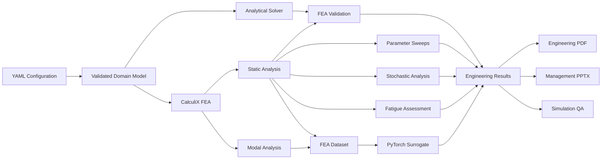
```mermaid
flowchart LR
    A[YAML Configuration] --> B[Validated Domain Model]

    B --> C[Analytical Solver]
    B --> D[CalculiX FEA]

    D --> E[Static Analysis]
    D --> F[Modal Analysis]

    C --> G[FEA Validation]
    E --> G

    E --> H[Parameter Sweeps]
    E --> I[Stochastic Analysis]
    E --> J[Fatigue Assessment]

    E --> K[FEA Dataset]
    F --> K
    K --> L[PyTorch Surrogate]

    G --> M[Engineering Results]
    H --> M
    I --> M
    J --> M
    L --> M

    M --> N[Engineering PDF]
    M --> O[Management PPTX]
    M --> P[Simulation QA]
```

---

## What This Project Demonstrates

| Engineering / software skill | Evidence in BodySimPy |
|---|---|
| Python engineering | Installable `src/` package, typed domain models, reusable workflows, scripts and CLI |
| Structural FEA automation | CalculiX input generation, execution, isolated work directories and result parsing |
| Verification and validation | Analytical cantilever references plus static mesh-convergence studies |
| Structural dynamics | Modal FEA, modal-result parsing and frequency studies |
| Parameter studies | Automated geometry/material sweeps and sensitivity plots |
| Stochastics | Reproducible Monte Carlo sampling, distribution summaries and sensitivity ranking |
| Fatigue | Power-law S-N model and Palmgren-Miner cumulative-damage assessment |
| Machine learning | PyTorch multi-output surrogate trained on FEA-generated data |
| Engineering evaluation | Held-out prediction metrics, sample-efficiency study, runtime benchmark and break-even study |
| Software quality | `pytest`, Ruff, strict `mypy`, GitHub Actions and feature-branch / pull-request workflow |
| AI-assisted development | Repository-level Copilot instructions, bounded prompt record and human validation log |
| Agent-based workflow | Deterministic simulation-QA agent that orchestrates engineering checks |
| Reporting | Automatically generated engineering PDF and management PowerPoint summary |

---

## Representative Results

The values below are representative outputs committed with the repository and are tied to the simplified crossmember study and its stated assumptions.

| Study | Representative result |
|---|---:|
| Static FEA mesh convergence | Tip-deflection error: **0.055%** at 160 elements |
| Static stress comparison | Stress error: **4.641%** at 160 elements |
| Structural dynamics | Mode-1 frequency: **49.401 Hz** |
| Stochastic study | **500** Monte Carlo samples |
| Stochastic threshold check | **0 / 500** samples above 350 MPa in the committed study |
| Fatigue demonstration | Miner damage **D = 0.122812** per defined spectrum |
| PyTorch surrogate – stress | Held-out MAPE: **1.06%** |
| PyTorch surrogate – deflection | Held-out MAPE: **1.27%** |
| PyTorch surrogate – mode-1 frequency | Held-out MAPE: **0.39%** |
| Runtime experiment | Approx. **2,870×** median surrogate/FEA evaluation speedup in the committed benchmark |

> Runtime values are hardware- and methodology-dependent. The stochastic threshold result is a sampled exceedance fraction for the defined input distributions, not a real-world structural failure probability.

---

## 1. Static FEA Verification

The baseline model is a rectangular hollow-section cantilever surrogate. BodySimPy generates a CalculiX beam model, runs the solver, parses solver outputs, and compares the finite-element response with analytical Euler-Bernoulli reference equations.

The mesh-convergence study demonstrates that tip deflection converges closely to the analytical reference. Stress recovery shows a small residual difference, which is retained transparently rather than hidden or tuned away.

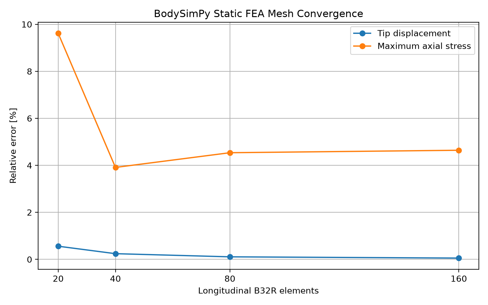

### Why the stress error is not forced to zero

The analytical stress expression and the finite-element stress recovery do not represent an identical numerical procedure. The remaining difference is therefore reported as a model/implementation limitation rather than treated as a calibration target.

---

## 2. Structural Dynamics

The workflow also executes CalculiX modal analyses and parses the requested eigenfrequencies. The committed baseline study extracts ten modes; the first mode is approximately **49.4 Hz**.

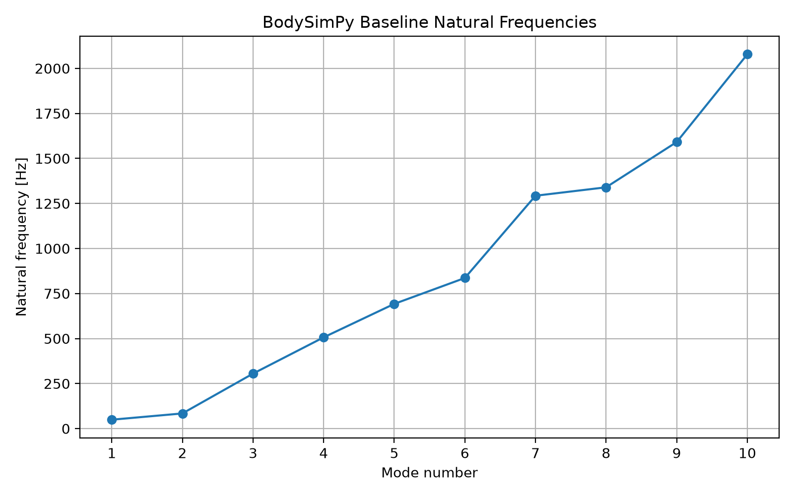

Material and geometry sensitivities can also be evaluated automatically.

<p align="center">
  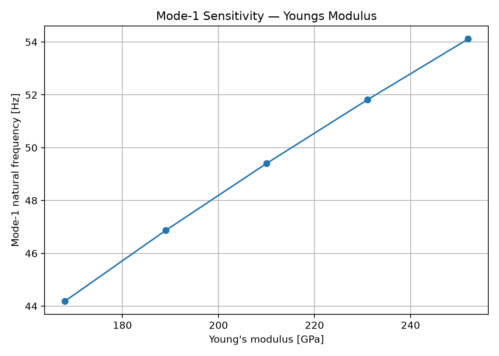
  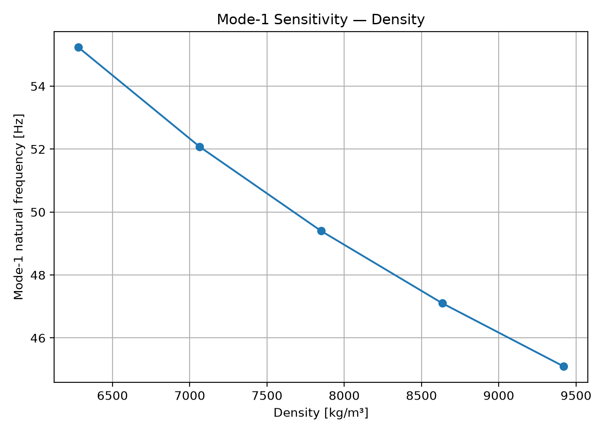
</p>

---

## 3. Parameter-Sweep Automation

BodySimPy automates repeated simulation studies rather than relying on manual solver execution. The parameter-sweep workflow can vary structural inputs, dispatch independent CalculiX runs, collect results, and generate validation data and figures.

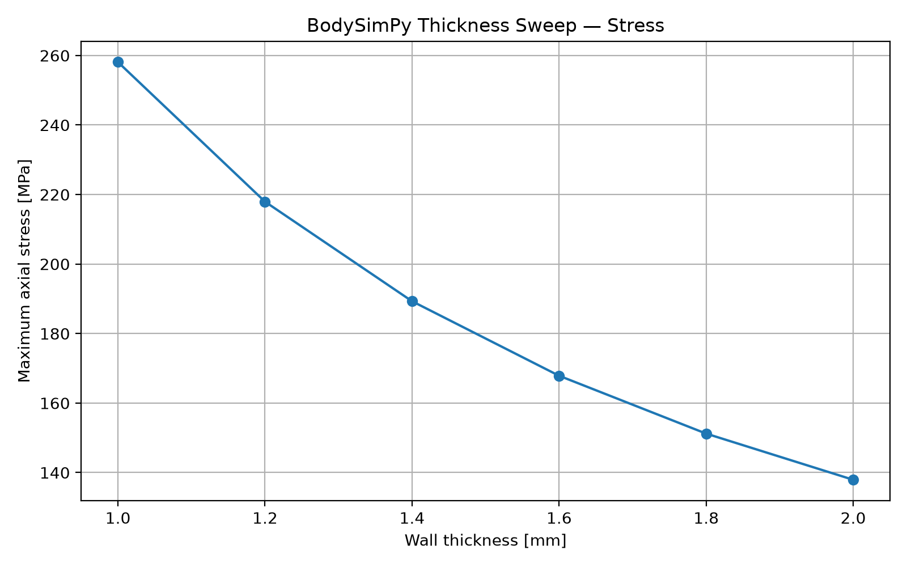

This architecture separates:

- engineering configuration;
- domain-model construction;
- solver execution;
- result parsing;
- analysis logic; and
- reporting/visualization.

---

## 4. Stochastic Engineering Study

A reproducible Monte Carlo workflow propagates uncertainty in wall thickness, Young's modulus, and tip load through repeated FEA evaluations.

The committed study contains **500 samples** and records distributions for maximum stress and first-mode frequency together with standardized linear sensitivity rankings and a correlation matrix.

<p align="center">
  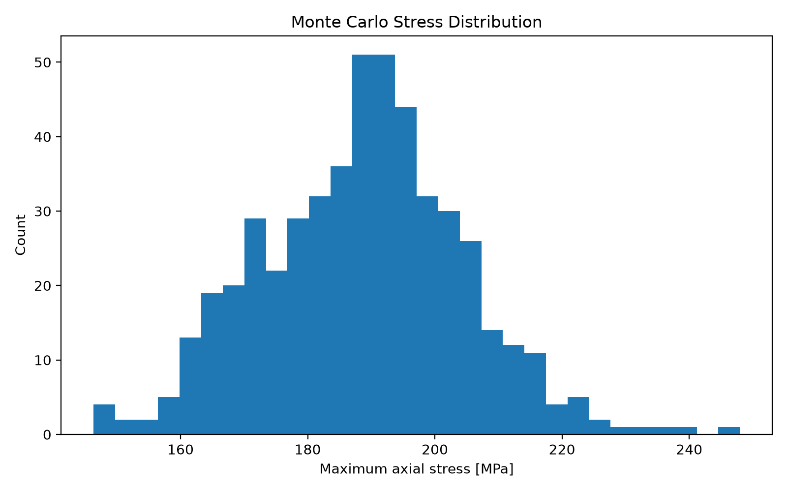
  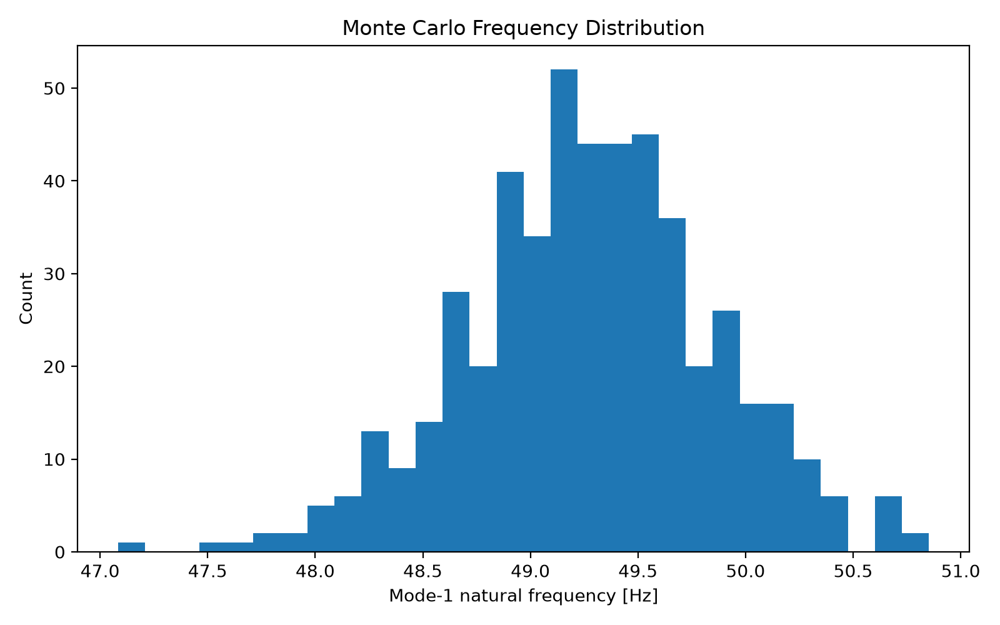
</p>

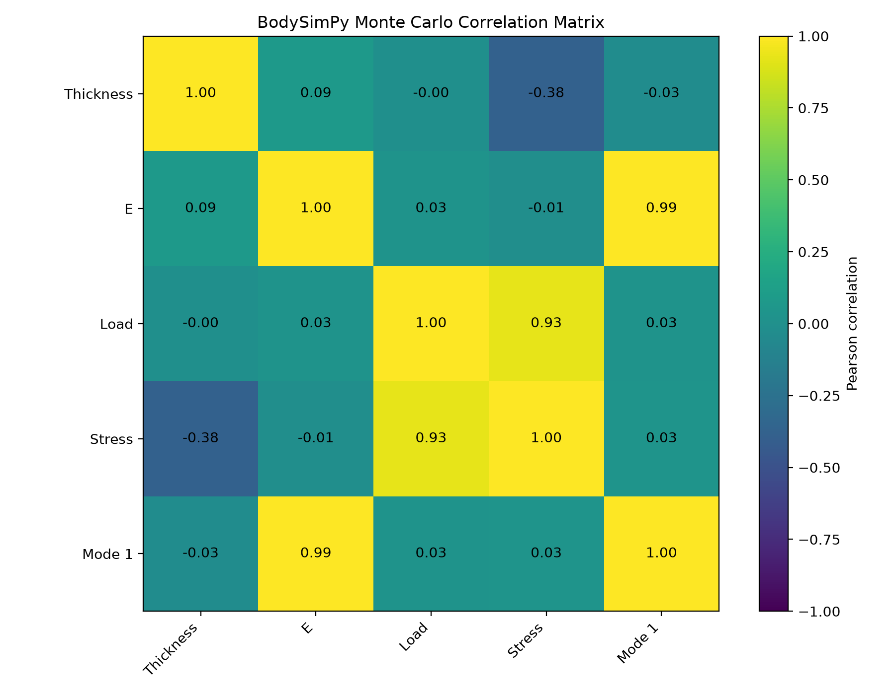

The stochastic module is intended as a transparent engineering uncertainty study. It does not claim production reliability prediction, manufacturing-tolerance validation, or vehicle-level failure probability.

---

## 5. Fatigue Assessment

The fatigue module implements a simplified power-law S-N relation and Palmgren-Miner cumulative damage:

$$
N = N_{ref}\left(\frac{\sigma_{ref}}{\sigma_a}\right)^m
$$

and

$$
D = \sum_i \frac{n_i}{N_i}
$$

For the demonstration spectrum currently defined in the project, the total calculated damage is **0.122812**, corresponding to approximately **8.14 repeats** of that exact spectrum to reach $D=1$ under the model assumptions. The `elevated_load` block contributes the largest damage fraction.

This is deliberately presented as a methodological demonstration. The project does not introduce unverified material-specific S-N curves, weld classes, mean-stress corrections, rainflow counting, or experimental durability correlation.

---

## 6. PyTorch Structural Surrogate

BodySimPy includes a PyTorch multi-output regression model trained on FEA-generated data. The surrogate predicts:

- maximum stress;
- tip deflection; and
- first-mode frequency.

Held-out evaluation in the committed test set gives approximately **1.06% stress MAPE**, **1.27% deflection MAPE**, and **0.39% frequency MAPE**.

<p align="center">
  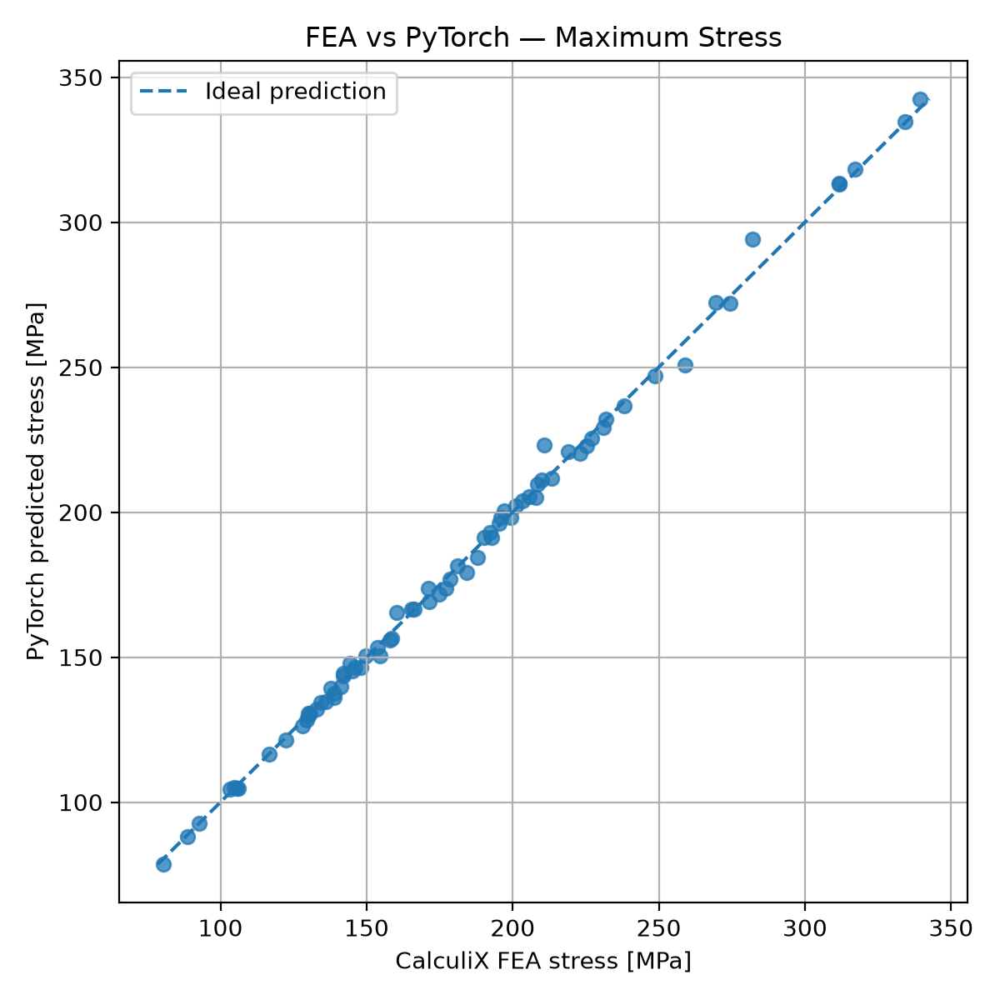
  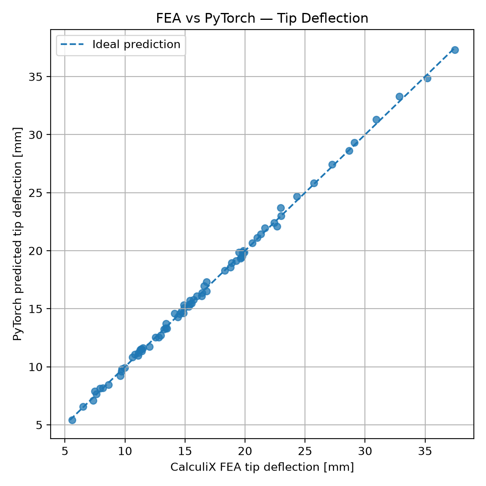
  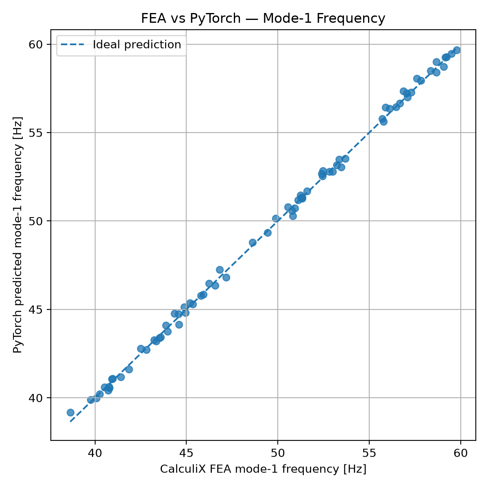
</p>

### Accuracy versus training-data cost

The repository also contains a repeated-seed sample-efficiency experiment to show how predictive accuracy changes as the number of FEA training designs grows.

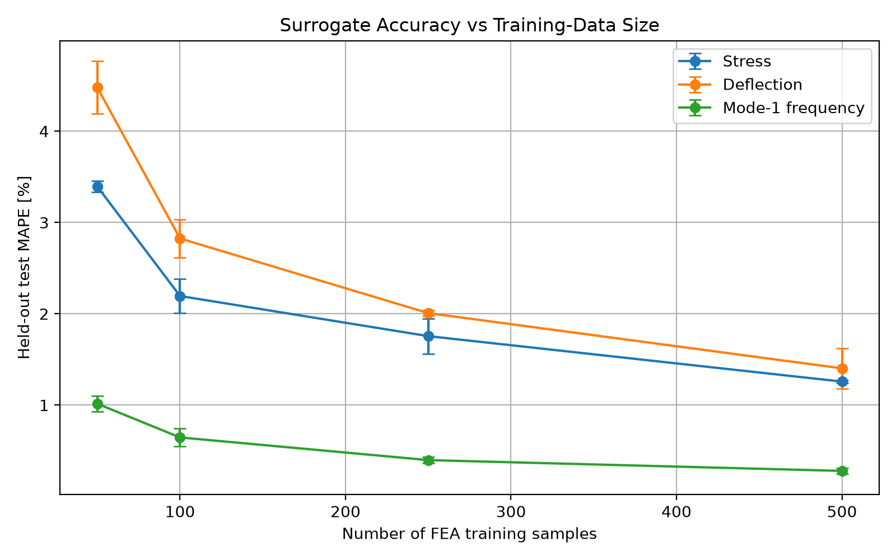

### Runtime and break-even study

A separate benchmark compares sequential CalculiX evaluation time with batched surrogate inference and estimates the number of design queries required to recover the cost of generating FEA data and training the surrogate.

<p align="center">
  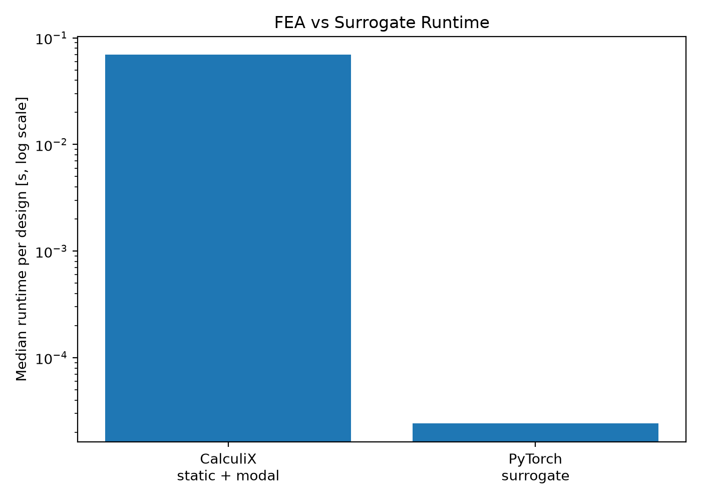
  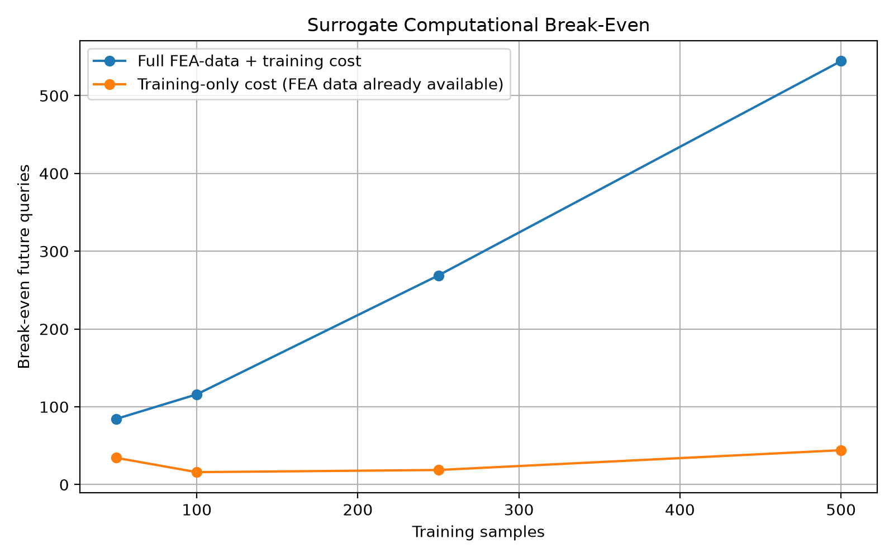
</p>

The committed benchmark shows a median per-design surrogate speedup of roughly **2,870×** relative to the measured sequential FEA evaluation. This value is an experiment result, not a universal performance claim.

---

## 7. Simulation QA Agent

BodySimPy includes a deterministic simulation-QA agent that orchestrates engineering checks over solver status, expected outputs, stress limits, modal shifts, and historical outlier behavior.

The agent returns explicit states such as `PASS`, `INVESTIGATE`, and `FAILED` together with findings and a recommended action.

The QA agent is **not** presented as an autonomous engineering authority. It is a tool-orchestration layer that helps surface conditions requiring engineering review.

See [`docs/simulation_qa_agent.md`](docs/simulation_qa_agent.md).

---

## 8. AI-Assisted Development With Human Validation

The repository documents bounded use of GitHub Copilot and prompt engineering rather than treating AI output as authoritative code.

Project-specific instructions define physical and software constraints such as:

- preserving SI units;
- not inventing solver results or material properties;
- preserving signed loads;
- respecting geometric validity;
- separating analytical references from FEA results; and
- validating AI-generated tests against engineering requirements.

The repository also contains a recorded prompt for configuration edge cases and a human validation log showing which AI suggestions were accepted, modified, rejected, or deferred.

See:

- [`.github/copilot-instructions.md`](.github/copilot-instructions.md)
- [`.github/prompts/configuration-edge-cases.prompt.md`](.github/prompts/configuration-edge-cases.prompt.md)
- [`docs/ai_assisted_development.md`](docs/ai_assisted_development.md)

---

## 9. Software Architecture

```text
BodySimPy/
├── .github/
│   ├── copilot-instructions.md
│   ├── prompts/
│   └── workflows/ci.yml
├── configs/
│   ├── baseline_crossmember.yaml
│   ├── fatigue_crossmember.yaml
│   ├── simulation_qa.yaml
│   ├── stochastic_crossmember.yaml
│   └── thickness_sweep.yaml
├── data/
│   └── surrogate/
├── docs/
│   ├── figures/
│   ├── validation/
│   ├── ai_assisted_development.md
│   └── simulation_qa_agent.md
├── reports/
│   ├── BodySimPy_Engineering_Summary.pdf
│   └── BodySimPy_Management_Summary.pptx
├── scripts/
├── src/bodysimpy/
│   ├── agents/
│   ├── analysis/
│   ├── config/
│   ├── domain/
│   ├── ml/
│   ├── modeling/
│   ├── reporting/
│   ├── solvers/
│   └── workflows/
├── tests/
│   ├── integration/
│   └── unit/
├── pyproject.toml
└── README.md
```

### Design principles

- **Configuration-driven:** YAML inputs are validated before analysis.
- **Solver-independent domain layer:** engineering objects are separated from CalculiX-specific code.
- **Reusable analysis modules:** scripts orchestrate package functionality instead of duplicating equations.
- **Explicit result parsing:** FEA quantities come from solver-generated files rather than hard-coded outputs.
- **Testable components:** analytical, parsing, configuration, analysis and agent logic are covered by automated tests.
- **Reproducible studies:** committed CSV results and figures provide traceable study outputs.

---

## 10. Automated Reporting

BodySimPy generates both engineering-facing and management-facing summaries programmatically.

- [Engineering Summary PDF](reports/BodySimPy_Engineering_Summary.pdf)
- [Management Summary PowerPoint](reports/BodySimPy_Management_Summary.pptx)

This separates engineering calculations from presentation formatting and demonstrates how simulation results can be transformed into repeatable decision-support artifacts.

---

## 11. Installation

### Requirements

- Linux or WSL recommended
- Python **3.11 or 3.12**
- CalculiX (`ccx`) for FEA/integration studies

Clone and create a virtual environment:

```bash
git clone https://github.com/savbcar/BodySimPy.git
cd BodySimPy

python -m venv .venv
source .venv/bin/activate
python -m pip install --upgrade pip
python -m pip install -e ".[dev]"
```

Install the optional machine-learning dependency when running the PyTorch studies:

```bash
python -m pip install -e ".[ml]"
```

On Ubuntu/WSL, CalculiX can be installed with:

```bash
sudo apt-get update
sudo apt-get install -y calculix-ccx
```

Confirm the solver is available:

```bash
ccx -v
```

---

## 12. Quality Gate

Before a change is considered complete, run:

```bash
ruff format --check .
ruff check .
mypy src
python -m pytest
```

GitHub Actions executes the same quality workflow on **Python 3.11 and 3.12** and installs CalculiX so solver-dependent integration tests can run in CI.

---

## 13. Running Representative Studies

Static/FEA validation:

```bash
python scripts/run_fea_validation.py
```

Modal analysis:

```bash
python scripts/run_modal_analysis.py
```

Thickness sweep:

```bash
python scripts/run_thickness_sweep.py
```

Stochastic study:

```bash
python scripts/run_stochastic_study.py
```

Fatigue assessment:

```bash
python scripts/run_fatigue_analysis.py
```

Train and evaluate the surrogate:

```bash
python scripts/train_surrogate.py
python scripts/evaluate_surrogate.py
```

Generate reports:

```bash
python scripts/generate_reports.py
```

Run the simulation-QA demonstration:

```bash
python scripts/run_simulation_qa.py
```

---

## 14. Development Workflow

The repository is developed through focused feature branches and pull requests. Changes are validated using automated formatting, linting, static typing and tests before they are merged to `main`.

For AI-assisted work, generated suggestions are treated as proposals. Engineering assumptions and tests are reviewed by the developer before implementation, and unsupported physical behavior is rejected rather than implemented simply to satisfy generated code.

---

## 15. What I Learned

This project strengthened my ability to connect mechanical-engineering reasoning with software-engineering practice:

- translating structural assumptions into validated software models;
- automating external FEA tools from Python;
- parsing solver outputs and comparing them with analytical references;
- designing reproducible parameter and uncertainty studies;
- implementing simplified fatigue methods without overstating their validity;
- generating machine-learning training data from simulation workflows;
- evaluating surrogate accuracy together with computational cost;
- building CI-tested, typed and modular engineering Python code; and
- using AI development tools while retaining human responsibility for engineering decisions.

---

## 16. Engineering Limitations

BodySimPy intentionally uses a simplified structural surrogate and should not be interpreted as a vehicle-body durability, crash, NVH, or production-signoff model.

Key limitations include:

- beam-level representation rather than shell/solid body-in-white geometry;
- idealized boundary conditions and loading;
- linear-elastic material behavior;
- no contact, joints, spot welds, adhesives or manufacturing effects;
- no experimental correlation;
- simplified analytical references based on beam theory;
- simplified S-N / Palmgren-Miner fatigue assessment;
- Monte Carlo inputs chosen for workflow demonstration rather than validated production tolerances;
- surrogate validity restricted to the sampled design space; and
- runtime benchmarks dependent on hardware, solver setup and measurement methodology.

These limitations are kept explicit because engineering automation is only useful when the assumptions behind the automation remain visible.

---

## 17. Future Development

Potential extensions include:

- shell-element structural models;
- joint/spot-weld representation;
- multiple load cases and load combinations;
- richer structural-dynamics and NVH studies;
- rainflow counting and mean-stress correction for fatigue;
- validated material- and joint-specific fatigue data;
- global sensitivity methods and more formal uncertainty quantification;
- hyperparameter optimization and uncertainty-aware surrogate models;
- experiment tracking and model/version provenance; and
- richer engineering dashboards and report visualizations.

---

## License

This project is released under the [MIT License](LICENSE).
